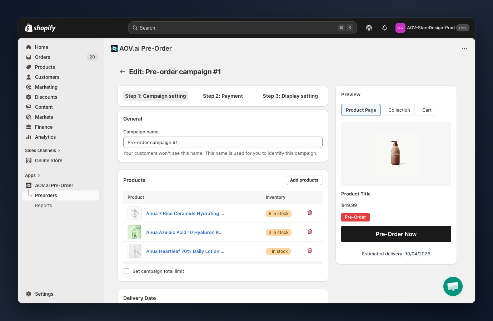
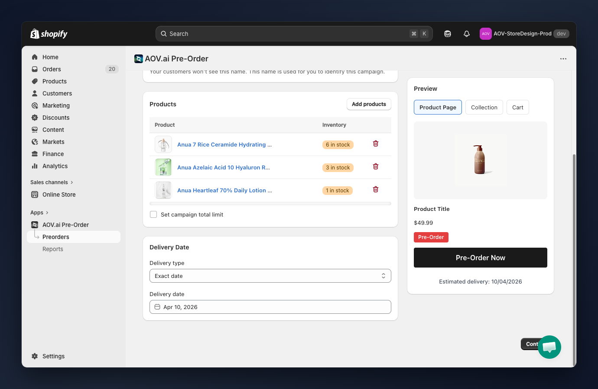

# Campaign Settings

## How to set up

Navigate to **AOV.ai Pre-Order > Preorders > Create campaign** (or click **Edit** on an existing campaign). The wizard opens on **Step 1: Campaign setting**.




### Name your campaign

- **Campaign name**: an internal label to identify this campaign in your admin. Customers will never see this name.
  ◦ Example: `Summer Pre-Order 2026` or `New Skincare Launch`



### Add products to the campaign

Click **Add products** to open the Shopify product picker. Select one or more products to include.

The product table shows each added product with:
- **Product name**: linked to the product in Shopify.
- **Inventory**: current stock level — `Out of stock` (red) or `X in stock` (yellow/green).
- **Remove**: click the trash icon to remove a product from the campaign.


If a product is included in multiple active campaigns, the most recently created campaign takes priority on the storefront.




### Set campaign total limit (optional)

Enable **Set campaign total limit** to restrict the total number of pre-orders that can be placed across all products in this campaign.

- When enabled, enter the maximum number of orders allowed.
- When the limit is reached, the pre-order button will no longer appear for this campaign.



### Choose delivery type

Select a **Delivery type** from the dropdown to define when customers can expect their order:

- **Exact date**: pick a specific delivery date using the date picker.
  ◦ Example: `Apr 10, 2026`
- **Date range**: set a start and end date to show a delivery window.
  ◦ Example: `Apr 10 – Apr 20, 2026`
- **Relative period**: enter a number of days, weeks, or months from the order date.
  ◦ Example: `14 days`
- **Relative interval**: enter a min and max range from the order date.
  ◦ Example: `2–4 weeks`
- **Custom text**: enter any free-form delivery note.
  ◦ Example: `Ships when available`


Tip: Use **Exact date** when you know the precise ship date. Use **Relative period** for delivery that depends on order date. Use **Custom text** for uncertain timelines.




### Set delivery date value

Based on your chosen delivery type, fill in the corresponding field:

- **Exact date** → select a date from the date picker.
- **Date range** → select start date and end date.
- **Relative period** → enter a number and select the unit (Days, Weeks, or Months).
- **Relative interval** → enter min value, max value, and select the unit.
- **Custom text** → type your delivery note.

The delivery information is shown to customers on the product page, cart, and order confirmation.



### Preview your settings

The **Preview** panel (right side) shows a live preview of how the pre-order button, badge, and messages will appear on your storefront.

- **Product Page**: shows the button, badge, delivery message, and payment message.
- **Collection**: shows the product card with badge overlay.
- **Cart**: shows the cart line item with delivery note.

The preview updates in real-time as you change settings across all three wizard steps.




Click **Continue** to proceed to [Payment Settings](payment-settings.md).
