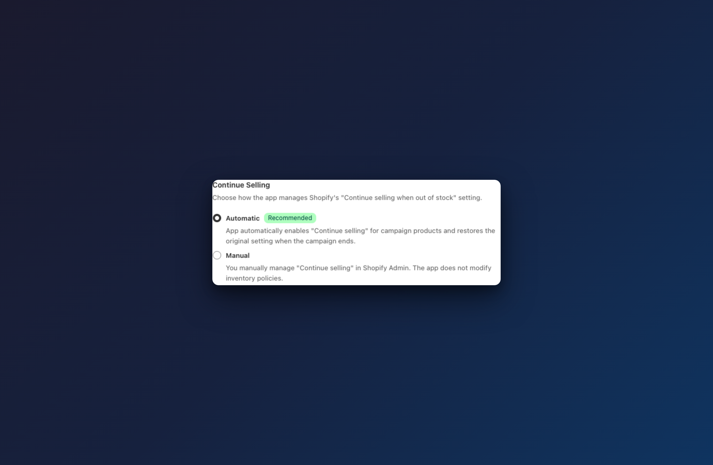

# Continue Selling

## How to set up

Navigate to **AOV.ai Pre-Order > Preorders > Create campaign** (or click **Edit** on an existing campaign). In **Step 1: Campaign setting**, find the **Continue Selling** card.




### Choose a continue selling mode

Select one of two options:

- **Automatic** *(Recommended)* — the app automatically enables Shopify's "Continue selling when out of stock" for all products in this campaign. When the campaign ends or is deleted, the app restores each product's original inventory setting.

- **Manual** — the app does not modify any inventory settings. You are responsible for enabling "Continue selling when out of stock" for each product yourself in Shopify Admin.


Tip: Use **Automatic** to avoid manual setup. The app handles everything — enabling "Continue selling" when the campaign starts and restoring the original setting when it ends.




### Understand why this matters

Shopify prevents customers from purchasing products that are out of stock unless "Continue selling when out of stock" is enabled. Without it:

- Out-of-stock products show **"Sold out"** instead of the Pre-Order button.
- Customers cannot add the product to cart, even with a pre-order campaign active.

The **Automatic** mode ensures this setting is always correctly configured for your campaign products.



### Warning when using Manual mode

If you select **Manual** and your pre-order trigger is set to **Out of stock**, a warning banner appears:

> Make sure "Continue selling when out of stock" is enabled in Shopify admin for all products in this campaign. Otherwise customers will see "Sold out" instead of "Pre-Order".

To enable it manually:
1. Go to **Shopify Admin > Products**.
2. Select the product, then scroll to the **Variants** section.
3. For each variant, check **Continue selling when out of stock**.


If you forget to enable "Continue selling" manually, customers will see "Sold out" and will not be able to place pre-orders.




### Change mode on an active campaign

Unlike the pre-order trigger, the continue selling mode **can be changed while the campaign is active**. When you change it:

- A confirmation modal appears explaining the immediate effect.
- **Switching to Automatic**: the app enables "Continue selling" for all campaign products right away.
- **Switching to Manual**: the app restores the original inventory policies for all campaign products right away.


Changes take effect immediately after confirmation. Your storefront will reflect the new setting within moments.




