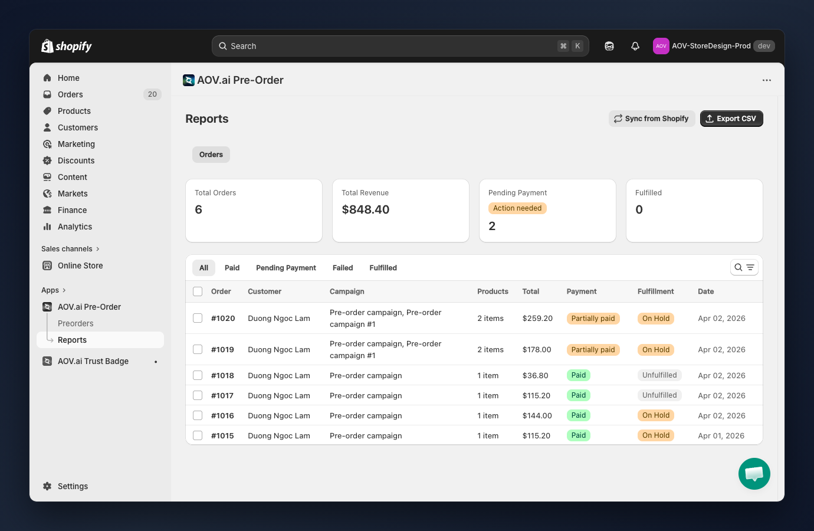
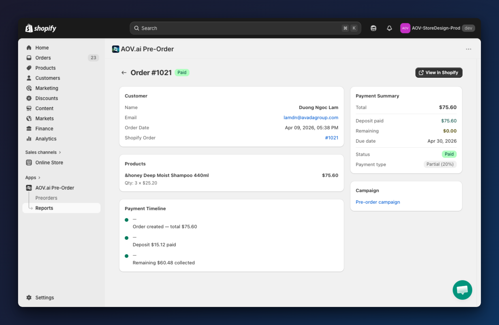

# Orders & Reports

## Overview

Navigate to **AOV.ai Pre-Order > Reports** to access the orders management page.

## How to use




### Review summary metrics

The four cards at the top show a quick snapshot:

- **Total Orders**: total number of pre-orders received.
- **Total Revenue**: combined revenue from all pre-orders.
- **Pending Payment**: orders with outstanding balances (deposit paid, remaining balance due). Shows an "Action needed" badge when count > 0.
- **Fulfilled**: orders that have been shipped or delivered.



### Filter orders by status

Use the tab bar to filter:

- **All**: every pre-order regardless of status.
- **Paid**: orders where full payment has been received.
- **Pending Payment**: orders with partial payment — remaining balance is due.
- **Failed**: orders where payment processing failed.
- **Fulfilled**: orders that have been shipped/delivered.



### Search for specific orders

Click the **search icon** to find orders by:
- Order number (e.g., `#1020`)
- Customer name
- Customer email



### View order details

Click any **order number** to open the detail page:

- **Customer info**: name, email, billing and shipping addresses.
- **Products**: line items with product image, variant, quantity, and price.
- **Payment timeline**: chronological record of all payment events.
- **Payment summary**: deposit amount, remaining balance, total, and payment deadlines.
- **Order metadata**: created date, campaign name, tags, and fulfillment status.

Click **View in Shopify** to open the order in Shopify Admin for fulfillment actions.



### Export orders to CSV

1. Select specific orders using the checkboxes on the left, or leave all unselected to export everything.
2. Click **Export CSV** (top right).
3. A CSV file downloads with order details, customer info, payment status, and fulfillment status.


Tip: Export "Pending Payment" orders regularly to follow up on outstanding balances.




### Sync data from Shopify

Click **Sync from Shopify** to pull the latest order updates. Use this when:

- Payment status changed in Shopify (e.g., customer paid remaining balance).
- Fulfillment status was updated in Shopify Admin.
- You suspect pre-order data is out of date.


The app automatically syncs orders via webhooks. Manual sync is only needed if you notice stale data.





### Payment status reference

| Status | Description |
|--------|-------------|
| **Paid** | Full payment received |
| **Partially paid** | Deposit received, remaining balance outstanding |
| **Processing** | Payment is being processed |
| **Failed** | Payment failed |
| **Collected** | Remaining balance has been collected |

### Fulfillment status reference

| Status | Description |
|--------|-------------|
| **Unfulfilled** | Order not yet shipped |
| **On Hold** | Waiting for remaining payment or other action |
| **Scheduled** | Fulfillment scheduled for a future date |
| **In Progress** | Order is being prepared/shipped |
| **Partial** | Some items fulfilled, others pending |
| **Fulfilled** | All items shipped/delivered |

---

## Collect Payment

When a campaign uses **Partial payment**, customers pay a deposit at checkout and the remaining balance is collected later. The **Collect Payment** feature lets you manually trigger payment collection.

### View order payment details

Click any **order number** to open the detail page.




### Review payment summary

The **Payment Summary** sidebar shows the current payment state:

- **Total**: full order amount.
- **Deposit paid**: amount already collected at checkout.
- **Remaining**: outstanding balance due from the customer.
- **Due date**: when the remaining balance is scheduled to be collected.
- **Status**: current payment status.
- **Payment type**: the payment method used (e.g., Partial 20%).



### Review payment timeline

The **Payment Timeline** section shows a chronological record of all payment events — order creation, deposit payment, and remaining balance collection (or failure).



### Collect remaining balance (single order)

When an order has a remaining balance, a **Collect remaining** button appears in the Payment Summary section. Click it to open the collection modal:

- The modal shows the exact remaining amount to collect.
- **Automatically send invoice if charge fails**: enabled by default. If the charge fails, the customer receives an invoice email with a link to pay manually.
- Click **Collect payment** to process.


The **Collect remaining** button only appears when the order status is **Partially paid**, **Failed**, or **Processing** and has a remaining balance greater than zero.




### Collect payments in bulk

From the order list, use the checkboxes to select multiple orders with outstanding balances, then click **Collect payments**.

- The modal shows how many orders will be processed.
- For 50+ orders, a caution message warns that processing may take a few minutes.
- A progress bar shows the collection progress.

After collection, a toast notification shows results: collected, invoices sent, failed, and skipped counts.


Tip: After bulk collection, check the **Failed** tab to follow up on orders that couldn't be charged.




### Invoice fallback

When a charge fails and **Automatically send invoice if charge fails** is enabled:

1. The app sends an invoice email to the customer via Shopify.
2. The customer receives a link to complete payment manually.
3. You can customize the invoice email template in **Shopify Admin > Settings > Notifications**.



