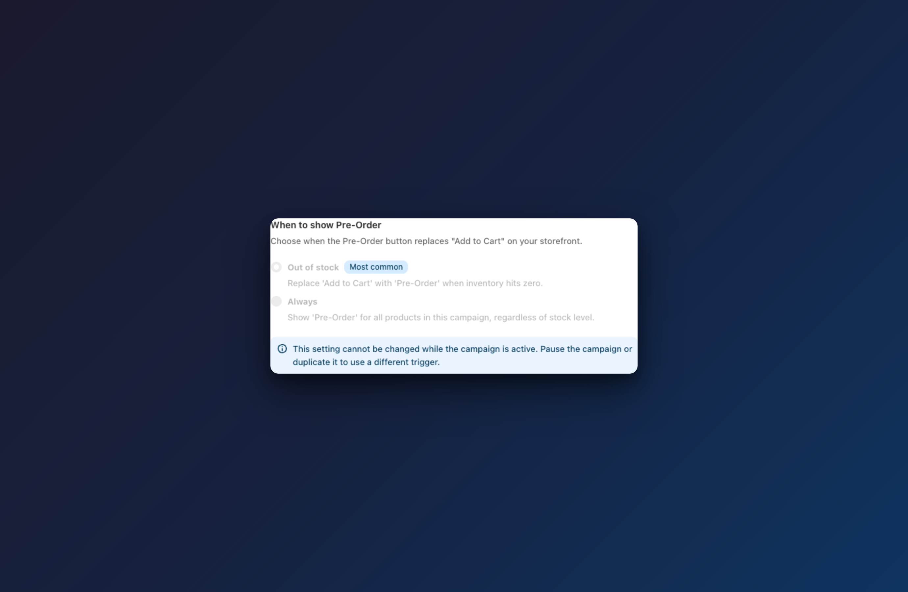

# When to Show Pre-Order

## How to set up

Navigate to **AOV.ai Pre-Order > Preorders > Create campaign** (or click **Edit** on an existing campaign). In **Step 1: Campaign setting**, find the **When to show Pre-Order** card.




### Choose when Pre-Order replaces Add to Cart

Select one of two trigger options:

- **Out of stock** — the Pre-Order button appears only when a product variant's inventory reaches zero. While the product is in stock, customers see the regular "Add to Cart" button.
  ◦ This is the **most common** option for pre-order campaigns.

- **Always** — the Pre-Order button appears for all products in this campaign, regardless of current stock level. Even if inventory is available, customers will see the Pre-Order button instead of "Add to Cart".


Tip: Use **Out of stock** if you want to sell normally until inventory runs out, then automatically switch to pre-orders. Use **Always** for product launches or exclusive pre-sales where you want every order to be a pre-order.




### Understand how this affects your storefront

The trigger determines when the Pre-Order widget appears:

| Trigger | Product in stock | Product out of stock |
|---------|-----------------|---------------------|
| **Out of stock** | Shows "Add to Cart" | Shows "Pre-Order" |
| **Always** | Shows "Pre-Order" | Shows "Pre-Order" |

On collection pages, the pre-order badge follows the same logic:
- **Out of stock**: badge appears only when all variants are out of stock.
- **Always**: badge appears on all campaign products.


This setting works together with **Continue Selling**. If a product is out of stock and "Continue selling" is not enabled, customers will see "Sold out" instead of "Pre-Order". See [Continue Selling](continue-selling.md) for details.




### Note: cannot change on active campaigns

This setting **cannot be changed while the campaign is active**. If you need to use a different trigger:

- **Pause** the campaign first, then change the setting.
- Or **duplicate** the campaign with the new trigger setting.


The trigger is locked on active campaigns to prevent unexpected changes to your storefront behavior while customers are browsing.




